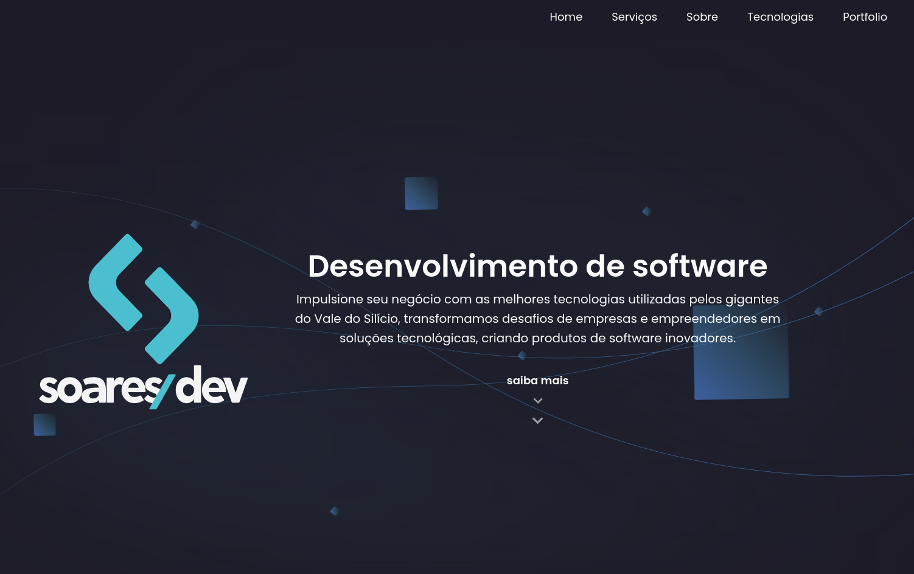
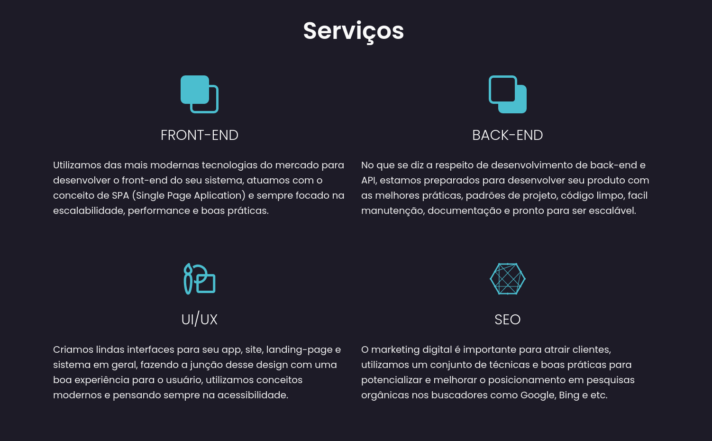
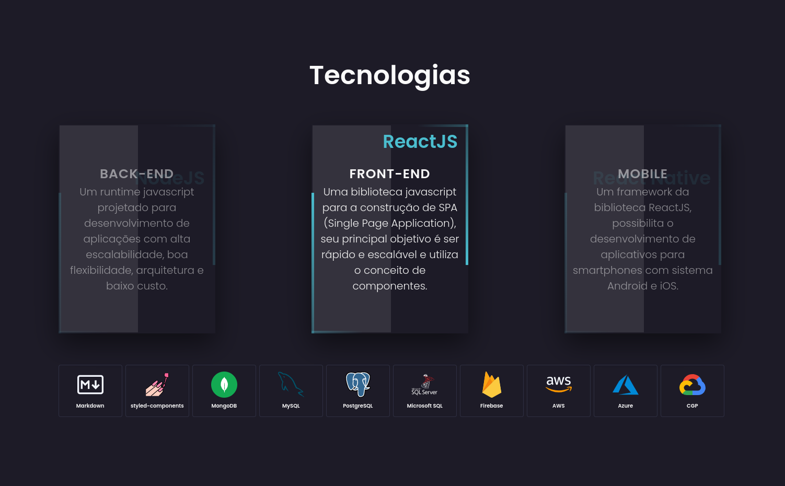
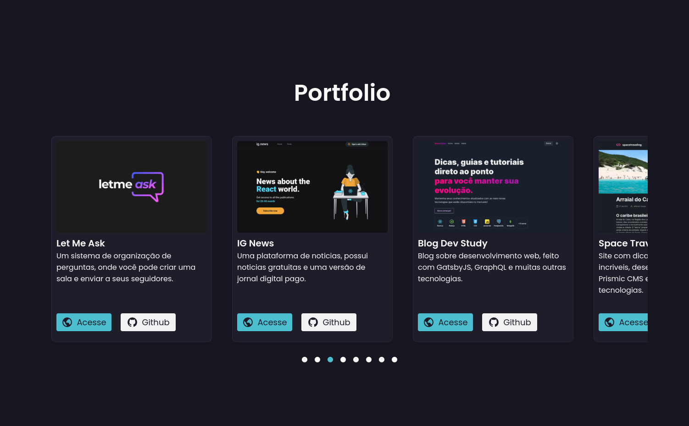
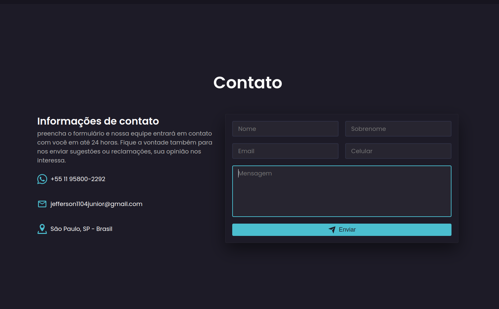
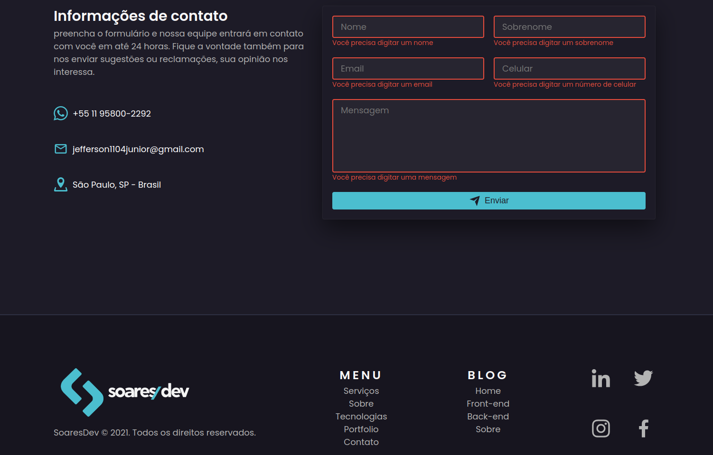

<div align="center" style="margin-bottom: 20px;">
  <h1>soaresdev.com</h1>
  <p align="center">
    
    
    
    
  </p>
  
</div>

### About project
This is my landing page, this project was developed with NextJS, TypeScript and has several other technologies, unit tests using Jest and react-testing-library, storybook, "aos" library for animation effects using scroll, styled-components for styling of sections and components, feature of BFF (back-end for front-end) along with nodemailer for sending emails, in the contact form I used the Joi library to validate the inputs, I used some features of next such as next/ dynamic and also good practices for a better performance of the bundle, in addition to the development of SEO and some techniques in the semantics of JSX.

### Configure and run project
To use the email sending feature in the contact form, you must configure your gmail account if you use gmail as a provider.

For that I followed these two tutorials that helped me a lot:
- [Link 1](https://www.woolha.com/tutorials/node-js-send-email-using-gmail-with-nodemailer-oauth-2)
- [Link 2](https://medium.com/nerd-for-tech/coding-a-contact-form-with-next-js-and-nodemailer-d3a8dc6cd645)

```bash
# Clone this repository
$ git clone https://github.com/jefferson1104/soaresdev.git

# Access the project folder
$ cd soaresdev

# Install dependencies
$ yarn

# Check the tutorial for using gmail with nodemailer provider

# Configure your .env, see .env.example

# Run storybook
$ yarn storybook

# Run tests
$ yarn test

# Run Project
$ yarn dev
```


### Screenshots
<p align="center">
  
  
  
  
  
  
  
</p>
